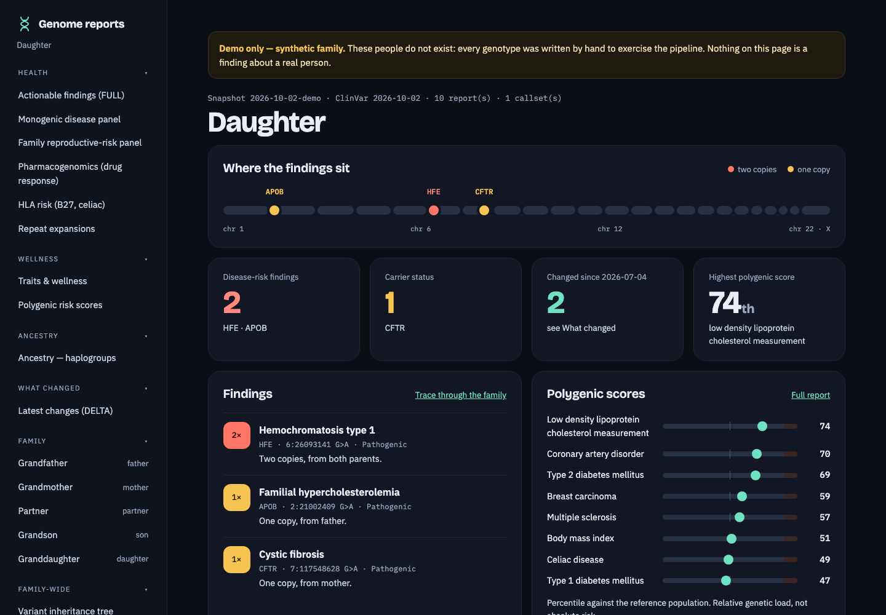
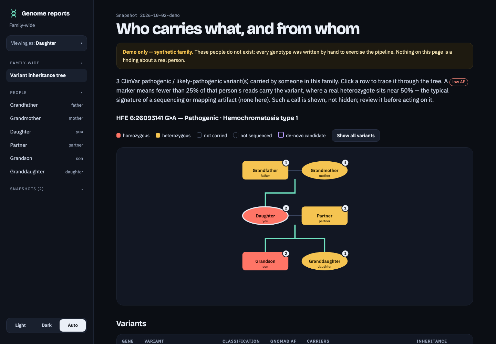
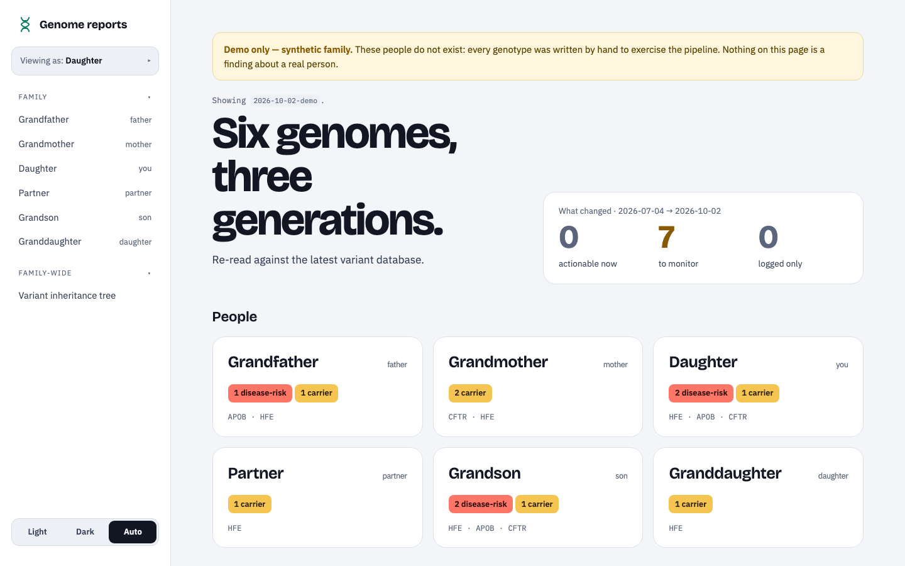

# Genome Ledger

[](LICENSE)
[](pyproject.toml)
[](#one-time-setup)
[](docs/docker.md)
[](docs/architecture.md)
[](#about)

**Your family's genomes, kept at home and re-read against every new ClinVar release — with a
dated record of what changed.** (A ledger in the bookkeeping sense: no blockchain involved.)

> ⚠️ **RESEARCH AND EDUCATIONAL USE ONLY**  
> This software is not a certified medical device and is not intended or validated for clinical diagnosis, treatment decisions, or patient care. Genetic variant classifications and predictions are research-grade estimations. Any medically actionable findings must be verified independently by a certified clinical genetics laboratory and discussed with a qualified medical geneticist or physician. Provided AS-IS without warranty of any kind.

## About

Genome Ledger is a self-hosted pipeline for a family's whole-genome data. It takes raw reads
(FASTQ) or finished VCFs, annotates them against a **dated, pinned** ClinVar snapshot, and
keeps everything in a local DuckDB database. When ClinVar publishes a new release it re-reads
the same genomes and writes a **DELTA report of exactly what changed**, so a variant
reclassified from "uncertain" to "pathogenic" next year doesn't go unnoticed.

- **Family-aware:** reads the pedigree, shows who carries what and from whom, flags carrier
  couples, compound heterozygotes and de-novo candidates (confirmed against the parents' reads).
- **More than ClinVar:** ACMG-style reasoning, polygenic scores calibrated against 1000 Genomes,
  pharmacogenomics, HLA, repeat expansions, structural variants and mtDNA.
- **Private by design:** runs on your own Mac or Linux machine; incidental findings are opt-in
  per person; `share` writes clean copies of a VCF or CRAM for handing to a doctor.
- **Who it's for:** people with their own sequencing data who are comfortable on the command
  line. It is not a clinical tool and does not replace a geneticist.



| | |
|---|---|
|  |  |
| **Who carries what, and from whom.** Pick a variant and the tree shows who has one copy, who has two, and the line it came down. | **The family at a glance**, labelled from one person's point of view, with what changed since the last database release. |

*Screenshots are of the built-in demo: a synthetic family, not real people. Light and dark
themes are both built in.*

## 60-Second Quickstart (Zero-Data Demo)

Run a complete demonstration of the pipeline, analytical database, and interactive HTML dashboards in a few seconds — no reference data, no annotation caches and no sequencing data needed. You need [`uv`](https://docs.astral.sh/uv/) and `bcftools` (with `tabix`/`bgzip`) on your PATH; `uv` fetches about 20 MB of Python packages on the first run.

```bash
git clone <repo-url>
cd genome-ledger
uv run python run.py demo
```

What this does:
1. Sets up an isolated demo environment (`demo_output/`).
2. Ingests a synthetic three-generation family (six members) from `tests/fixtures/trio/`.
3. Evaluates monogenic disease risks (*HFE* hemochromatosis, *CFTR* cystic fibrosis, *APOB* familial hypercholesterolemia).
4. Evaluates single-SNP wellness traits (lactase persistence, eye colour, muscle sprint/endurance, alcohol flush, earwax).
5. Reads HLA tag SNPs (HLA-B27, celiac DQ2.5/DQ8) from the demo genomes.
6. Builds a second, earlier snapshot of the same family and runs the DELTA report between the two — what changed, triaged into tiers.
7. Populates DuckDB and renders the HTML dashboards: one page per person, plus a family inheritance page showing who carries what, and from whom.

Everything lands under `demo_output/reports/`: markdown in `md/`, the same reports as structured JSON in `json/`, and the pages you open in `html/`.

Every page the demo writes is marked **Demo only**. Four report types cannot be computed
without sequencing reads or reference downloads — repeat expansions (ExpansionHunter),
pharmacogenomics (PharmCAT), haplogroups (Haplogrep / Yleaf) and polygenic risk scores
(PGS Catalog + 1000 Genomes). For those the demo ships sample tool output
(`tests/fixtures/demo/toy_results.json`) and runs it through the real interpretation,
consent and report code, so you see the genuine report layout over **illustrative values
that are not derived from the demo genomes**; each of those pages says so under its title.

Launch the local web UI to inspect the results:
```bash
GENOMES_ROOT=demo_output uv run python run.py serve
# Open http://127.0.0.1:8765/  → latest snapshot → people, or the family inheritance tree
```

On Linux x86-64 the same demo runs with nothing installed but Docker:

```bash
docker compose up demo      # then open http://127.0.0.1:8765/
```

[`docs/docker.md`](docs/docker.md) covers running the whole pipeline that way.

## Genomic File Hierarchy: What File Unlocks What

The pipeline is **modular**. You do not need raw sequencing reads (FASTQ) to use the downstream interpretation and reclassification engine.

| File Type | Typical Size (30x WGS) | What Pipeline Capabilities It Unlocks | Hardware Profile |
|---|---|---|---|
| **Raw Reads** (`.fq.gz`) | ~60–90 GB / sample | Alignment (`align`), variant calling (`call`), SV discovery | **Profile C** (CUDA GPU recommended) or CPU cluster |
| **Aligned Reads** (`.cram`) | ~15–25 GB / sample | *De novo* mutation parental confirmation (`denovo`), phasing (`phase`), callability (`callable`) | **Profile B** (Workstation) or Profile A |
| **Called Variants** (`.vcf.gz`) | ~150–800 MB / sample | **Core Pipeline (~90% of features):** ClinVar snapshots, DELTA reclassification, ACMG scoring, disease panels, PRS scores, pharmacogenomics (PGx), traits, HLA risk | **Profile A** (Any modern laptop or desktop, CPU only) |
| **Analytical Warehouse** (`.duckdb`) | ~50–200 MB / family | Sub-second SQL queries (`query`), longitudinal diffs, instant dashboard generation | **Profile A** (Lightweight CPU) |

> 💡 **Have existing VCFs?** If you already have called VCFs from a sequencing provider or clinical test, skip straight to `ingest` + `normalize`. You only need **Profile A** hardware (a standard laptop or desktop, no GPU required). See [`docs/hardware-and-scope.md`](docs/hardware-and-scope.md) for full hardware profile specifications.

## Why it's built this way

- **Raw genomes are immutable.** They are the source of truth, copied read-only and
  mirrored to backups; never modified, never committed to git.
- **Each run is pinned to a dated snapshot** of ClinVar (+ recorded VEP/gnomAD
  versions). Two runs over the same normalized genome are therefore reproducible and
  **diffable** — that diff is the whole point.
- **Normalize once.** `bcftools norm` gives a canonical variant representation so a
  later diff reflects real database changes, not representational drift.

## Layout

Code lives here (git). Data lives under `~/genomes` (the `GENOMES_ROOT` env var,
never in git).

## Documentation

| Document | What it covers |
|---|---|
| [`docs/runbook.md`](docs/runbook.md) | Plain-language recipes for whoever operates this: add a person, read the reports, restore from backup, troubleshoot |
| [`docs/architecture.md`](docs/architecture.md) | Diagrammed walkthrough of the stages, tools and dependencies |
| [`docs/docker.md`](docs/docker.md) | Running with Docker Compose (Linux x86-64): the three data directories, setup, serving, scheduling |
| [`docs/report-formats.md`](docs/report-formats.md) | Where reports live, what every report file looks like, how to add a report or an output format |
| [`docs/hardware-and-scope.md`](docs/hardware-and-scope.md) | Which files unlock which features, hardware profiles, legal framing, the consent filter |
| [`docs/prs-guide.md`](docs/prs-guide.md) | The polygenic scores in the panel and how to add one |
| [`docs/prs-architecture.md`](docs/prs-architecture.md) · [`docs/polygenic-panel-design.md`](docs/polygenic-panel-design.md) | How polygenic scoring works, and why these traits |
| [`docs/stewardship-and-succession.md`](docs/stewardship-and-succession.md) | Keeping a family's genomes usable for decades: backups, formats, handover, ethics |

## One-time setup

```bash
cd ~/Projects/genome-ledger
uv sync
uv run python run.py setup        # ~40 GB on disk; ~1 h on a fast desktop, ~3 h on a cloud VM
export RAW_ARCHIVE=/Volumes/…/genomes        # optional: off-machine raw mirror
```

`setup` fetches the reference genome, builds the alignment index (single-threaded: ~35 min
on a fast desktop, ~75 min on cloud vCPUs), downloads the annotation cache (26 GB on disk,
~90 min on a cloud VM including the VEP build) and fetches the tools (a few minutes). If you
will only ever ingest ready-made VCFs you still need all of it except the alignment index.
Ensembl's installer often loses the connection partway through the 27 GB cache file and
starts that download again; it recovers on its own, but budget ~60 GB of transfer rather
than 30.

On macOS `setup` installs the command-line tools with Homebrew. On Linux it checks for
them and tells you what is missing; on Debian or Ubuntu:

```bash
sudo apt install bcftools samtools tabix bwa fastp default-jre-headless perl git \
  build-essential unzip curl zlib1g-dev libbz2-dev liblzma-dev libcurl4-openssl-dev \
  libssl-dev libdbi-perl libarchive-zip-perl libwww-perl libjson-perl liblist-moreutils-perl cpanminus
```

The `sv` and `hla-type` stages run their tools in Docker. If you want them, install Docker
and add yourself to its group before `setup` (`sudo usermod -aG docker $USER`, then log in
again); otherwise `setup` warns that it could not pull those two images and carries on.

## Per-sample (once each)

From raw reads: map each sample to its FASTQ pair in `~/genomes/incoming/manifest.tsv`
(`sample  vendor_id  relation  sex`; the read files in `incoming/` start with the vendor_id —
`<vendor_id>_1.fq.gz`/`_2`, `_R1.fastq.gz`/`_R2`, or one `_S1_L001_R1_001.fastq.gz` pair per
lane, streamed in lane order; the sequencer is read off the read names),
then align → call → ingest → normalize:

```bash
uv run python run.py align  father    # FASTQ → marked-dup CRAM (fastp | bwa-mem | markdup)
uv run python run.py call   father    # CRAM → VCF (GATK HaplotypeCaller, scattered; MT haploid)
uv run python run.py ingest ~/genomes/called/father.GRCh38.vcf.gz --sample father --relation father --sex male
uv run python run.py normalize father
# …repeat for each family member, then record the relationships in
# ~/genomes/family/family.tsv (one row per person: id, display_name, sex, father,
# mother, partner — see family.example.tsv).
```

`family/family.tsv` is the source of truth for the family graph. `pedigree.ped` is
**generated from it** (`pipeline/pedigree.py`) for Mendelian and trio tooling, so
editing `pedigree.ped` by hand is lost the next time it is regenerated.

**One row per person, never per callset.** The same person can be sequenced more than
once: a bare sample id (`Adam`) is this pipeline's own calls, and a suffixed one
(`Adam_vendor`, `Jan_t2t`) is an alternate callset of the *same* person. Those
belong in `manifest/samples.tsv` only — `pedigree.person_of()` resolves them back to
their owner, so relationships, dashboards and PED rows all treat them as one genome
called twice. Adding a callset as its own row in `family.tsv` builds a duplicate family
tree (a person ends up as their own sibling and their children as their nieces);
`Family.validate()` now reports such a row.

Already have called VCFs (e.g. from a vendor or a GPU box)? Skip straight to
`ingest` + `normalize`. See `docs/hardware-and-scope.md` for hardware
profiles and offloading `align`/`call` to a GPU box.

An ingested sample has no `called/<sample>.GRCh38.vcf.gz`, so the genotype-lookup
stages (`traits`, `hla`, `prs`, `ancestry`) read its **normalized** VCF instead —
never the raw ingested file, whose contig naming is whatever its source used. The
stages that read the **CRAM** (`sv`, `repeats`, `callable`, `mito`, `phase`,
`hla-type`, `force-call`, and CYP2D6 within `pgx`) cannot run for a VCF-only sample
at all.

**The VCF must be GRCh38.** `ingest` refuses a mismatched build by checking the chr1
contig length. To bring a GRCh37/hg19 callset over, lift it first:

```bash
java -jar ~/genomes/tools/gatk-4.6.1.0/gatk-package-4.6.1.0-local.jar LiftoverVcf \
  -I in.hg19.vcf.gz -O lifted.vcf -R ~/genomes/refs/GRCh38.chr_named.fa \
  -CHAIN ~/genomes/refs/liftover/hg19ToHg38.over.chain.gz \
  --REJECT rejected.vcf --RECOVER_SWAPPED_REF_ALT true \
  --WRITE_ORIGINAL_POSITION true --WARN_ON_MISSING_CONTIG true
```

`--RECOVER_SWAPPED_REF_ALT` is not optional (without it a large share of records
reject as `MismatchedRefAllele`), and `--WRITE_ORIGINAL_POSITION` is what later lets
you check whether a suspicious call came from a badly-behaved lift. Read the reject
file: `NoTarget` is benign, a large `MismatchedRefAllele` count means the wrong chain
or the wrong build.

## Periodic scan (the heart of it)

```bash
uv run python run.py scan          # snapshot → (incremental) annotate+load → FULL + DELTA + ACMG
uv run python run.py scan --full   # force a from-scratch re-annotation of everyone
```

**Optional notification.** Set `NOTIFY_CMD` and the scan runs it when it finishes, with a
one-line summary as the last argument (no shell involved) — e.g.
`NOTIFY_CMD="ntfy publish genome"`. Unset, nothing is sent; a failing notifier never fails
the scan.

**Incremental by default.** A sample whose inputs (genome, ClinVar, VEP cache) are
unchanged is copied forward; when only ClinVar advanced, just the carried variants at
ClinVar-changed coordinates are re-annotated (the rest are copied forward). A full
re-annotation — the reproducibility anchor — is forced by `--full`, a VEP-cache bump, or
the first scan of each month. See `SCAN_CLINVAR_DELTA` in `pipeline/config.py`.

Outputs, under `~/genomes/reports/md/<date>/` (see [docs/report-formats.md](docs/report-formats.md)):
- `<person>/full_<sample>.md` — current actionable variants per person: every ClinVar record
  with a (Likely) pathogenic term, compound classifications included
  (`Pathogenic/Pathogenic,_low_penetrance|risk_factor` is reported, labelled low penetrance)
- `<person>/panel_<sample>.md` — monogenic disease panel (carrier vs affected)
- `_family/panel_family.md` — recessive genes carried by ≥2 members
- `<person>/acmg_<sample>.md` — reasoned ACMG/AMP classification + ClinVar divergences
- `_family/delta_<prev>_to_<date>.md` — what changed, **triaged** into
  Actionable now / Monitor closely / Log only / Ignore (multi-factor score, persisted to
  the `triage_results` table)

Every report ends with a closing caveats section. On the FULL, ACMG and DELTA reports it
is the auto-generated **Assumptions & Known Limitations** block (snapshot versions, model
availability, panel scope, callability, child-genome absence).
The scan also records per-variant provenance/confidence (`annotation_provenance`) and a
cross-snapshot timeline (`variant_history`) that feeds the triage stability factor.

Automate it weekly (scans only when a database actually changed):

```bash
cp launchd/com.example.genomeledger.plist ~/Library/LaunchAgents/
launchctl load ~/Library/LaunchAgents/com.example.genomeledger.plist
```

## Pedigree queries

```bash
uv run python run.py query queries/de_novo.sql \
    --param snapshot=2026-06-26 --param child=daughter --param father=father --param mother=mother
```

Available: `de_novo`, `recessive`, `compound_het`, `x_linked`, `segregation`.

## Commands

| Command | What it does |
|---------|--------------|
| `demo` | run a zero-data end-to-end demonstration on a synthetic six-member family |
| `setup` | install tools (incl. bwa, GATK) + download GRCh38 FASTA, bwa index, VEP cache |
| `align` | FASTQ → marked-dup CRAM (fastp \| bwa-mem \| fixmate \| sort \| markdup) |
| `call` | CRAM → VCF (GATK HaplotypeCaller, sub-chromosomal scatter, MT haploid, hard-filtered) |
| `ingest` | register a raw VCF (read-only, checksummed, mirrored) |
| `normalize` | split multiallelics + left-align a sample (once) |
| `snapshot` | create a dated, pinned ClinVar+versions snapshot |
| `annotate` | VEP-annotate a sample against a snapshot |
| `load` | load annotated output into DuckDB |
| `report` | write FULL reports for a snapshot |
| `panel-report` | write monogenic disease-panel reports for a snapshot |
| `acmg` | reasoned ACMG/AMP classification of panel-gene variants (+ ClinVar divergences) |
| `pgx` | pharmacogenomics report (PharmCAT) for a sample |
| `ancestry` | mtDNA + Y haplogroup report for a sample |
| `traits` | single-SNP traits/wellness report for a sample |
| `hla` | HLA risk (B27, celiac) via tag SNPs for a sample |
| `hla-type` | full classical HLA typing (arcasHLA, in Docker) from a sample's CRAM |
| `prs` | polygenic risk scores (PGS Catalog) for a sample — [which scores, and how to add one](docs/prs-guide.md) |
| `force-call` | genotype the fixed positions that `traits`, `hla` and small `prs` scores look up, from the reads — [why and when](docs/runbook.md#recipe-force-calling--making-not-in-the-vcf-mean-something) |
| `repeats` | repeat-expansion report (ExpansionHunter) for a sample |
| `sv` | structural-variant / CNV report (Manta) for a sample |
| `mito` | mitochondrial variants with heteroplasmy (GATK Mutect2 mito mode) for a sample |
| `callable` | callability / coverage report (mosdepth) for a sample |
| `phase` | read-backed phasing cis/trans (WhatsHap) for a sample |
| `denovo` | trio de-novo variants for a child, confirmed off **both parents' CRAMs** (force-call + raw pileup) |
| `segregation` | trio segregation: resolve compound hets by which parent transmitted each variant (any distance, no child reads needed) |
| `interpret` | regulatory-effect scores for non-coding variants (Enformer / Borzoi on a GPU box) for a snapshot |
| `consent` | record or withdraw a person's opt-in to incidental findings; with no arguments, list them |
| `diff` | write DELTA report between two snapshots (multi-factor triage into 4 tiers) |
| `provenance` | record provenance/confidence + variant history for a snapshot (`--backfill` for history over all snapshots) |
| `validate` | replay an old snapshot's triage vs a later ClinVar snapshot; measure past-delta precision (`--replay --truth`) |
| `scan` | the periodic chain; incremental by default (`--full` forces re-annotation) |
| `check-releases` | the scheduled entry point: scan only if upstream ClinVar changed, then re-score PRS reports that predate a change to the trait panel |
| `share` | copy a person's VCF (or `--cram`) to `share/<person>/` for handing to someone else — header rebuilt without command lines, paths or internal ids |
| `render` | (re)generate every derived format (HTML, JSON) and the dashboards from the markdown |
| `serve` | local web server for the report dashboards |
| `query` | run a parameterized SQL file against DuckDB |
| `mirror-1kg` | one-time local mirror of the 1000 Genomes phased VCFs (~35 GB); speeds up `prs` |
| `migrate-reports` | one-time: move reports from the pre-`reports/md/` layout (dry-run unless `--apply`) |
| `family-migrate` | one-time: rename role-based sample ids (`father`, `mother`) to neutral names |

## Reading the reports

```bash
uv run python run.py render                          # latest snapshot
uv run python run.py render --snapshot 2026-09-06    # an older dated dir, in place
uv run python run.py serve                           # → http://127.0.0.1:8765/
```

Reports are markdown; HTML is rendered from it into a tree of its own:

```
~/genomes/reports/
  md/                        ← the source of truth: LATEST snapshot + per-genome reports
    2026-08-18/Adam/full_Adam.md   2026-08-18/_family/delta_….md
    genome/Adam/prs_Adam.md  pgx_Adam.md  hla_Adam.md  …
  md-history/                ← older snapshots' markdown
  json/                      ← every report as structured JSON, same paths
  html/
    index.html               ← the stable entry point; links into the latest snapshot
    2026-08-18/
      index.html             ← that snapshot's own front page
      index_Adam.html        ← one dashboard per PERSON (not per callset)
      inheritance.html       ← family-wide: who carries what, and from whom
```

`reports/md/` contains nothing but current markdown reports, each opening with a small
metadata header, so it can be handed whole to a search or retrieval tool. The layout, the
file contract and how to add another output format are in
[docs/report-formats.md](docs/report-formats.md).

Each person's dashboard is a two-pane page. The navigation tree is on the left; the right
side opens on a summary — a genome map with each finding pinned on its chromosome, the
headline counts, the findings with where each came from, polygenic percentiles, and cards
for drug response, HLA and the maternal line — and then shows whichever report you pick.
The summary is read from the reports themselves, so it cannot disagree with them.

Individual report pages stay single-column, with their styles inline, so one can be emailed
or archived on its own. Pages follow a **Light / Dark / Auto** switch (remembered by the
browser) and make no network requests: the fonts are bundled (`pipeline/fonts/`, SIL Open
Font License) and copied to `reports/html/assets/fonts/`; a report opened without that
folder falls back to system fonts.

`inheritance.html` draws the family tree once and traces a selected variant through it —
which parent transmitted it, or a de-novo mark where neither parent's callsets carry it.
That de-novo mark is a *candidate*: the `denovo` stage force-calls both parents and piles
up their raw reads, and its report is the authority.

**Low allele fraction.** A heterozygous call carries the variant on ~50% of reads. When
fewer than `LOW_VAF_THRESHOLD` (default **25%**, [config.py](pipeline/config.py)) do, the
FULL and ACMG reports mark the zygosity `HET ⚠️ low allele fraction 3/18 (17%) — review`
and the inheritance page adds a red `low AF 3/18` pill. The read counts come from the
normalized VCF's `AD` at report time (`pipeline/allele_balance.py`), so no reload is needed
when the threshold changes — just re-run `report` / `acmg` / `render`. The call is flagged,
never dropped:

| Depth | P(true het falls below 25%) |
|---|---|
| 20× | 0.6% |
| 30× | 0.3% |
| 45× | ~0.04% |

It catches homopolymer slippage and most mismapped-paralog calls. It cannot catch paralog
artifacts whose alt fraction sits near 50%, or right at the line; those need region-level
review, e.g. a force-call and a look at the raw reads. The threshold and what it does not
catch are also stated in every report's *Assumptions & Known Limitations* block.

The landing pages and the inheritance tree have a **Viewing as** picker at the top of the
navigation tree: choose a person and everyone is labelled by their relationship to them
("father", "granddaughter", "son-in-law"). The choice is remembered by the browser, and
opening someone's own page selects them. The pages stay static files.

The navigation tree on every page ends with a collapsed **Snapshots** section listing the
other dated directories, so you can move between ClinVar runs for the same person. Each
dashboard build refreshes that list on the older snapshots' pages too.

Only the FULL / panel / ACMG / DELTA reports are per-snapshot; the per-sample stages
(PGx, PRS, ancestry, SV, HLA, …) have no snapshot of their own. An older snapshot's page
therefore files them under *Current (not from this snapshot)* and says so, rather than
implying an older page can show results from a genome sequenced after it.

`inheritance.html` is built from the **variant rows**, not from the markdown beside it, so
it can only be built on a machine whose database holds that snapshot. Elsewhere `render`
warns and skips it, and the pages simply omit the link.

`serve` exposes only `reports/html/` — never the raw genomes, the stage directories or the
markdown and JSON trees — and binds to localhost by default.

**Incidental findings are opt-in.** Results in the adult-onset, untreatable category —
repeat-expansion disorders, and polygenic traits marked as severe with no intervention —
are withheld from a person's reports until that person opts in
(`run.py consent <sample> adult_onset_untreatable yes`). The report says something was
withheld and how to see it. An operator who wants full disclosure for everyone sets
`PRS_S1_GATE=0`; see [docs/hardware-and-scope.md](docs/hardware-and-scope.md) §5.
