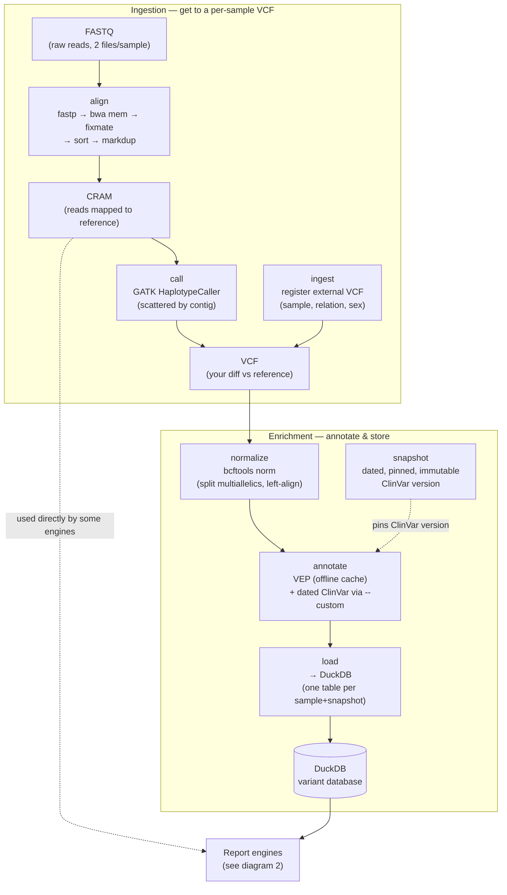
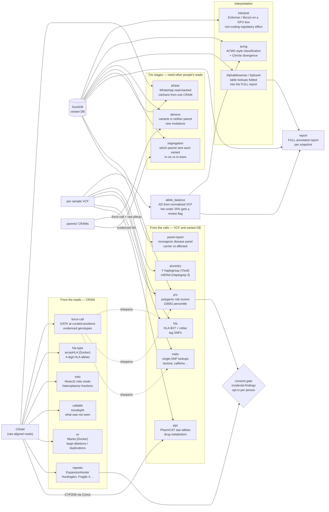
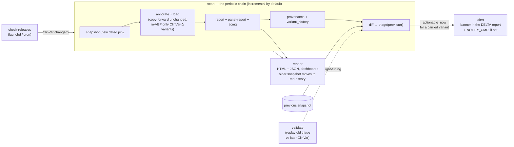
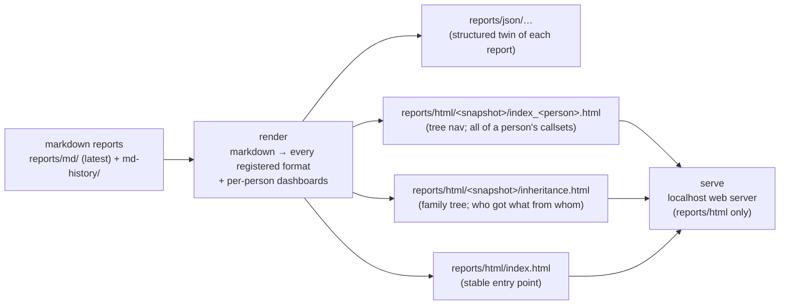
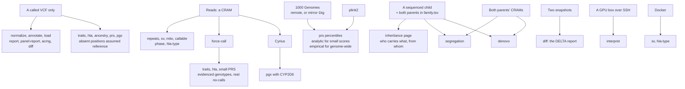
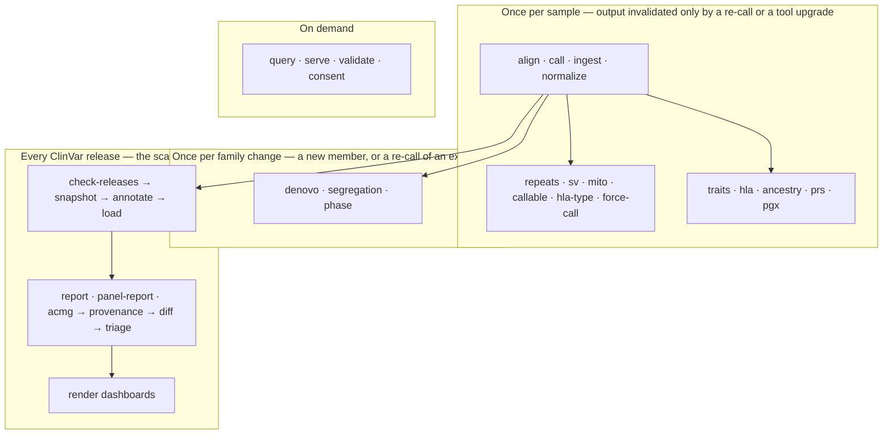

# Architecture — Genome Ledger

A software-engineer's view of the pipeline. The genome is a ~3-billion-character
reference string; *your* DNA is that string with a few million edits. A sequencer shreds
your DNA into billions of short, error-prone fragments ("reads"). The pipeline
**reassembles the shreds, diffs them against the reference to find your edits ("variants"),
then enriches and interprets those edits into reports.**

---

## 1. Core data flow — from raw reads to a queryable variant database

Two entry points converge at `normalize`: you can sequence raw reads yourself
(`align` → `call`), or register an externally-produced VCF directly (`ingest`).

**Why each step exists**
- **align** — reassemble the shredded reads against the reference. Output is a CRAM
  (compressed aligned reads). CRAM 3.0 is pinned because GATK's bundled htsjdk can't read 3.1.
- **call** — the `git diff` of genomics: emit only positions where you differ from the
  reference. Scattered across contigs for parallelism; MT is called haploid.
- **normalize** — canonicalize the diff: the same edit can be written multiple ways, so
  split multi-allelic sites and left-align indels for consistent joins.
- **snapshot** — a dated, immutable pin of the disease database (ClinVar). This is what
  makes results *reproducible* and *diffable over time* (see diagram 4).
- **annotate** — enrich each variant: which gene, what consequence, population frequency
  (gnomAD), and disease significance (ClinVar). VEP runs offline; ClinVar comes from the
  pinned snapshot.
- **load** — land everything in DuckDB so engines are just SQL queries.

---

## 2. Report engines — variant DB + CRAM fan out into the reports

Each report comes from one engine. An engine reads the **DuckDB variant table** (anything
annotation-driven), the **per-sample VCF** (fixed-position lookups), or the **CRAM** (when
only the raw reads can answer). Two things sit across them: `force-call` turns an assumed
"same as reference" into an evidenced genotype for the lookup engines, and the consent gate
decides whether an incidental finding is shown to the person it is about.

| Engine | Reads from | What it answers | Benefit |
|---|---|---|---|
| **pgx** | VCF + CRAM | How do your genes change drug metabolism? | Actionable: statin risk, warfarin dosing. The only dual-substrate engine — PharmCAT reads the VCF, but CYP2D6 is too structurally complex for it, so Cyrius genotypes that gene off the CRAM |
| **panel-report** | DuckDB | Do you carry known single-gene disease variants? | BRCA risk, carrier screening, family reproductive risk |
| **prs** | VCF + 1000G | Common-disease risk as a weighted sum of variants | Ancestry-matched percentile (diabetes/heart) |
| **traits** | VCF | Single-variant traits | Lactose/caffeine/earwax/alcohol-flush |
| **ancestry** | VCF | Deep paternal/maternal lineage | Genealogy (haplogroups) — Haplogrep3/Yleaf run over the MT and Y *calls*, not the reads |
| **hla** | VCF | Immune-gene disease tags | HLA-B27, celiac risk |
| **repeats** | CRAM | Repeat-expansion diseases | Huntington/Fragile X — invisible to SNV calling |
| **sv** | CRAM | Large deletions/duplications | Missing exons (BRCA/DMD), which SNV calling cannot see |
| **callable** | CRAM | Coverage / what wasn't seen | Distinguishes "no variant" from "region not covered" |
| **mito** | CRAM | Mitochondrial heteroplasmy | Mutect2 mito-mode — what fraction of mtDNA carries a variant |
| **phase** | DuckDB + own CRAM | Are two hits on the same copy? | WhatsHap — resolves pairs transmission cannot, and needs no parents |
| **segregation** | DuckDB + parents' CRAMs | Which parent transmitted each variant? | in-cis (one copy intact) vs in-trans (both hit) — the difference between benign and disease |
| **hla-type** | CRAM | Full classical HLA alleles | arcasHLA — cross-checks the tag-SNP calls and gives 4-digit types |
| **interpret** | DuckDB + GPU box | Does a non-coding variant disturb regulation? | Enformer / Borzoi scores for carried regulatory variants; optional, needs a GPU |
| **denovo** | DuckDB + parents' CRAMs | Which variants are new in this child? | Expected 40–150 SNVs/generation — one of the few stages with a hard published prior |

> **Why `force-call` exists** — `call` emits only *differences*, so a
> missing position is ambiguous — "same as reference" vs "not looked at." Lookup engines need
> the genotype at *fixed* positions including hom-reference. The `force-call` stage
> (`pipeline/forcecall.py`) GATK-genotypes the **curated union** of those positions
> (traits/HLA single-SNP + small-PRS scoring files) off the CRAM (`--alleles` +
> `EMIT_ALL_ACTIVE_SITES`), turning an *assumed* hom-ref into an *evidenced* `0/0` and
> surfacing genuine no-calls. `traits` and the small-PRS path prefer it when present;
> genome-wide PRS stays on plink2.

---

## 3. Tool & data dependencies — what `setup` installs and who needs it

`run.py setup` provisions the reference data and every tool that ships as a download. The
basic command-line tools (bcftools, samtools, bwa, fastp, a JRE, a C toolchain) come from
Homebrew on macOS, which `setup` drives, and from your package manager on Linux, which it
only checks. This is the "what do I need on the box" map.

```mermaid
flowchart TD
    subgraph TOOLS["External tools (installed/located by setup)"]
        BWA["bwa + fastp + samtools"]
        GATK["GATK (Java)"]
        BCF["bcftools + tabix/bgzip"]
        VEPT["VEP (built from source)"]
        PCAT["PharmCAT 3.2 (Java)"]
        CYRT["Cyrius (CYP2D6, Python)"]
        EH["ExpansionHunter"]
        YLEAF["Yleaf"]
        HG["Haplogrep 3"]
        PLINK["plink2 (genome-wide PRS)"]
        MOS["mosdepth"]
        DOCK["Docker images<br/>Manta, arcasHLA (optional)"]
        DUCK["DuckDB (python)"]
    end

    subgraph DATA["Reference & annotation data"]
        REF["GRCh38 reference<br/>+ bwa index"]
        CLINVAR["ClinVar (dated)"]
        GNOMAD["VEP cache / gnomAD"]
        AM["AlphaMissense table<br/>(bgzip + tabix)"]
        LIFT["hg19 to GRCh38 chain<br/>+ chr-named reference"]
        PGS["PGS Catalog scores<br/>(downloaded per-id)"]
        KG1G["1000G AF (remote,<br/>cached per PGS)"]
        ENS["Ensembl REST<br/>(traits coord resolve)"]
    end

    s_align["align"] --> BWA & REF
    s_call["call"] --> GATK & REF
    s_norm["normalize"] --> BCF
    s_anno["annotate"] --> VEPT & CLINVAR & GNOMAD
    s_pgx["pgx"] --> PCAT & CYRT
    s_prs["prs"] --> PGS & KG1G & PLINK
    s_traits["traits"] --> BCF & ENS
    s_hla["hla"] --> BCF
    s_anc["ancestry"] --> YLEAF & HG
    s_rep["repeats"] --> EH & REF
    s_cov["callable"] --> MOS
    s_sv["sv"] --> DOCK
    s_hlat["hla-type"] --> DOCK
    s_report["report"] --> AM
    s_lift["lifting an older-build VCF"] --> LIFT
    s_load["load"] --> DUCK
```

**Notes that bite in practice**
- **VEP** is built from source (needs a C toolchain + Perl HTSlib); `setup` load-tests
  `Bio::DB::HTS` to confirm a *usable* build, and applies a macOS-only dylib fix.
- **Java tools** (GATK, PharmCAT) need a JRE on PATH; macOS keg-only openjdk is prepended.
- **AlphaMissense** is a ~1 GB table re-compressed to bgzip+tabix so it can be point-queried.
- **Ensembl REST** is used at build-time to resolve trait rsIDs → GRCh38 coordinates; at
  run-time `traits` only needs `bcftools`.
- **Nothing is network-facing at run time** beyond the reference/annotation downloads and
  the optional `serve` dashboard, which binds to localhost and exposes only `reports/html/`.

---

## 4. Reproducibility — snapshots, triage, provenance, validation

The killer feature: disease databases change. A variant once "uncertain" can later be
reclassified "pathogenic." Because every run is pinned to a dated snapshot, you can **diff
two snapshots and surface variants the family actually carries that just changed meaning.**
A consumer report is a photograph; this is a movie.

- **check-releases** only triggers a `scan` when there is something to do — cheap to run on
  a timer. That is: upstream ClinVar changed, the newest snapshot's scan never completed, or
  a sample that is now normalized was not part of the last completed scan. A scan writes a
  completion marker naming the samples it covered (`.scan_complete` in the snapshot
  directory); a sample without a normalized VCF is skipped, named in the notification, and
  picked up by the next check once it is normalized.
- **polygenic scores** are not part of the scan — they do not depend on ClinVar. What makes
  one stale is the trait panel changing (a newly registered score, an edited row). Each PRS
  report is stamped with the panel it was scored against, and `check-releases` re-scores the
  callsets whose stamp no longer matches, whether or not a scan ran. Only callsets that
  already have a PRS report; `PRS_AUTO_RESCORE=0` disables it.
- **diff baseline**: a scan is compared against the newest older snapshot whose scan
  *completed*. A snapshot left behind by a failed scan holds only some of the family, so it
  is never used as the baseline — the retry diffs against the last good scan instead.
- **actionable** means any term of the ClinVar classification is (Likely) pathogenic
  (`pipeline/clinsig.py`). ClinVar values are compound —
  `Pathogenic/Pathogenic,_low_penetrance|risk_factor` — so they are matched per term, in
  SQL and in triage alike, and a low-penetrance qualifier is shown beside the finding
  rather than used to drop it.
- **incremental scan** (`pipeline/incremental.py`): a sample's `variants` rows depend only on
  the genome, the snapshot's ClinVar, and the VEP cache. When all three are unchanged the rows
  are copied forward; when only ClinVar advanced, *just* the carried variants at ClinVar-changed
  coordinates are re-run through VEP (correct because ClinVar is attached `type=exact`) and the
  rest copied forward. `--full`, a cache bump, or the first scan of the month force a full
  re-annotation — the reproducibility anchor.
- **diff → triage** (`pipeline/triage.py`): every changed variant gets a multi-factor,
  auditable score (ACMG/ClinVar evidence · in-silico model distance · rarity · cross-snapshot
  stability · gene context) mapped to four tiers — **actionable_now / monitor / log_only /
  ignore**. The actionable tier for a carried variant triggers high-visibility report alerts. Verdicts + the
  per-factor breakdown persist to `triage_results`.
- **provenance** (`pipeline/provenance.py`): every value in a report is traceable —
  `annotation_provenance` records each source's version, a confidence band, and whether it fed
  an ACMG code; `variant_history` records the per-snapshot timeline that drives the stability
  factor.
- **validate** (`pipeline/validate.py`): replays an old snapshot's triage with today's rules and
  judges it against a later snapshot's ClinVar (confirmed / reverted / stable-noise) — measures
  how often past deltas were useful vs noise, and is the loop for tuning the `config.TRIAGE_*`
  weights.

**Derived companion tables** (all in DuckDB, joinable on the canonical `(chrom,pos,ref,alt)`
key, rebuildable from snapshots + code): `triage_results`, `annotation_provenance`,
`variant_history`, `scan_inputs` (incremental digest ledger), `validation_runs` /
`validation_findings`. Every report also carries an auto-generated **Assumptions & Known
Limitations** section built from the live manifest + actual inputs.

---

## 5. Serving & interpretation layer — how humans consume it

- **Markdown is the source of truth.** Every stage files its report through
  `pipeline/reportpaths.py` under `reports/md/` (the latest snapshot and the per-genome
  reports; older snapshots move to `md-history/`). Each opens with a metadata header and
  ends with a caveats section — see [report-formats.md](report-formats.md).
- **render** turns every report into each registered format — HTML and JSON today, in
  `reports/html/` and `reports/json/` at the same relative paths — then builds one
  dashboard per *person* (not per callset) inside the snapshot's directory, plus the
  landing pages. A dashboard opens on a summary (genome map, headline counts, findings,
  polygenic percentiles) read from those reports (`pipeline/dashboard.py`); the look,
  light/dark/auto and the bundled fonts live in `pipeline/theme.py`.
- **inheritance** draws the family tree once and traces each ClinVar-actionable variant
  through it — transmitting parent, or a de-novo *candidate* where neither parent's
  callsets carry it (`denovo` is what settles those).
- **serve** exposes *only* `reports/html/` over localhost; raw genomes, stage directories
  and the markdown and JSON trees are never web-reachable, and the server has no POST route
  at all.

---

## 6. What each stage needs before it can run

Not every stage can run for every person: it depends on which files you hold for them and
on who else in the family has been sequenced.

- **A VCF is enough for most of it.** Everything annotation-driven, and the lookup engines,
  run from calls alone. What you lose without reads is certainty at positions the VCF does
  not mention, and the stages that only reads can answer.
- **Reads add depth, not a different pipeline.** Structural variants catch the whole-exon
  deletions the panel report says it cannot assess; callability separates "no variant" from
  "not adequately covered"; `force-call` replaces assumed hom-reference with evidence.
- **Family adds the rest.** The trio stages read the *parents'* CRAMs, because "the parent
  does not carry it" has to be confirmed against reads rather than inferred from a VCF that
  is silent.

---

See [hardware-and-scope.md](hardware-and-scope.md) for hardware profile notes and the GPU-bound
interpretation stages.

---

## 7. Run cadence — what runs once, what runs on every release

There is a mechanical rule for this, and the report layout encodes it: **a stage's report
lives outside the dated snapshot directories exactly when it does not depend on ClinVar.**
Those are the one-off stages — `ancestry.py`, `sv.py`, `pgx.py` and their siblings — and
their reports are filed under `reports/md/genome/<person>/` rather than under a snapshot
(see [report-formats.md](report-formats.md)).

**Once per sample.** Everything from `align` through the report engines that read only the
CRAM or the VCF. These answer questions about *the genome*, and your genome does not change.
Re-run them only when the underlying calls change (a re-alignment, a new caller) or when the
tool itself is upgraded and you want the newer answer — a new PharmCAT, a new ExpansionHunter
catalogue. Nothing upstream in ClinVar can invalidate them.

**Once per family change.** The trio stages depend on the genome *and* on who else has been
sequenced. Sequencing a new family member makes every existing child's `denovo` and
`segregation` worth re-running, because a parent's callset is what those stages subtract
against. Changing the filters is the other trigger.

**Every ClinVar release.** This is the only genuinely recurring chain, and it is the point of
the snapshot design in §4 — the same variants, re-judged against a database that moved.
`check-releases` on a timer means it costs nothing when nothing changed, and `incremental`
means a release that touches 300 of your variants re-annotates 300, not three million.

**Practical consequence.** After a re-call, the one-off stages are a fan-out of independent
per-sample jobs with no ordering between them beyond `align → call → normalize`; the scan
chain is a strict sequence. The first parallelises across machines, the second does not.
