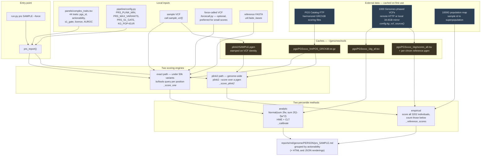
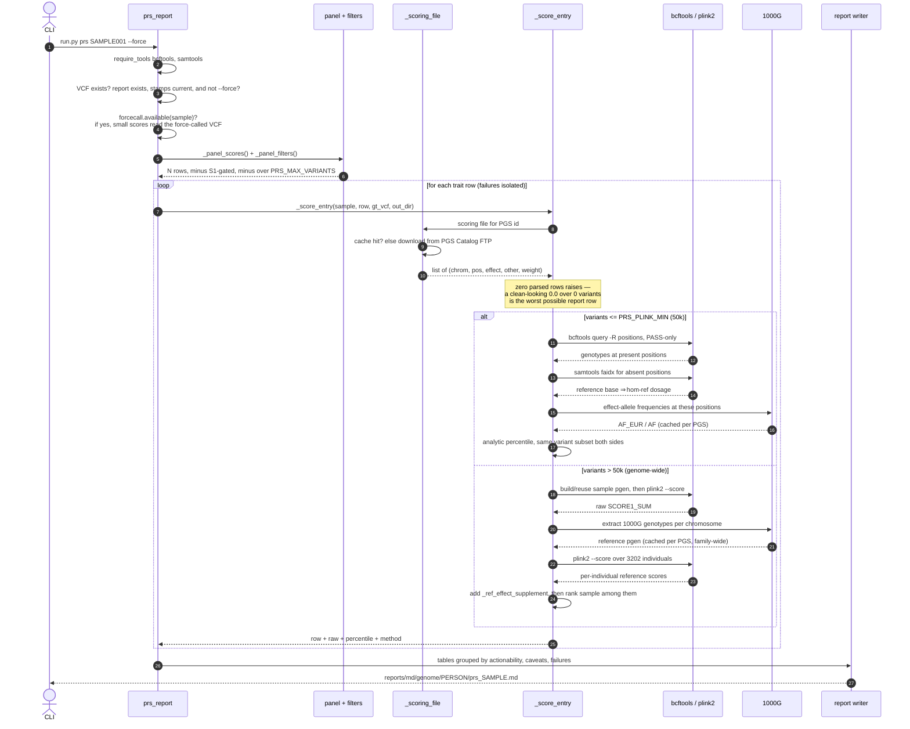
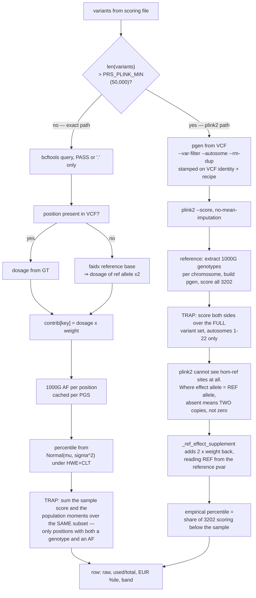
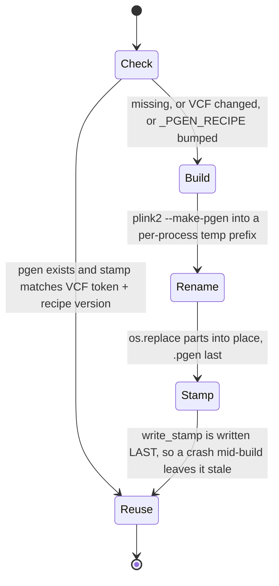

# PRS subsystem — architecture

How the polygenic-risk-score stage works, written for someone who reads code, not chromatograms.
All of it lives in [`pipeline/prs.py`](../pipeline/prs.py); everything else is config,
a panel file, and two external data sources.

## The 60-second version, in IT terms

A PGS (polygenic score) is a **linear model with no intercept**, published as a flat file:

| Genomics term | What it actually is |
|---|---|
| Scoring file (`PGS000018_hmPOS_GRCh38.txt.gz`) | A TSV of `(feature_key, expected_value, weight)` — one row per genome position |
| Variant / position `chr9:22125504` | The primary key. Two of them per file column: `hm_chr`, `hm_pos` |
| Effect allele | Which of the two possible values at that key counts |
| Dosage | The feature value: `0`, `1` or `2` copies of the effect allele |
| Raw score | `Σ dosage × weight` — a plain dot product |
| VCF | A **sparse delta** of the sample against the reference genome. Rows exist only where the sample differs |
| Hom-ref | "Key absent from the delta" ⇒ the sample has the reference value, i.e. two copies of it |
| Percentile | The rank of this dot product inside a population of 3202 reference individuals |
| 1000 Genomes (1000G) | That reference population, published as remote VCFs with per-population frequencies |
| GRCh38 / hg38 | The coordinate system. Everything here is GRCh38; mixing builds is a silent key-mismatch bug |

Two properties of the input drive almost every design decision in this module:

1. **The VCF is sparse.** Absence means hom-ref, not "unknown". Where the *effect allele is the
   reference allele*, an absent row means dosage **2**, not 0 — the single most common source of
   bias in this code (see `_ref_effect_supplement`).
2. **Score sizes span five orders of magnitude.** 14 variants (endometriosis) to ~7.3M (cutaneous melanoma). One engine
   cannot serve both, so there are two, split at `PRS_PLINK_MIN = 50_000`.

## Component map

## End-to-end sequence

One `prs` run scores every row of the panel in a loop. Each row is isolated: a 404 or a truncated
download costs that one trait, not the run (`prs_report` in [`prs.py`](../pipeline/prs.py)).

## Engine routing and the two bias traps

The interesting part is not the dot product — it's making the sample's score and the reference
distribution cover **the same variant set**. Both branches get this wrong in opposite directions
if you are careless, and both corrections are in the code with the incident written into the comment.

Why the traps matter, concretely: restricting the reference scoring to the sample's own covered
sites is textbook **ascertainment bias**. A variant-only VCF's covered sites are exactly the sites
where the sample is non-reference, so the sample carried alt alleles at every scored site by
construction while the reference individuals carried them at population frequency. Every sample
lands in the top percentile — and two unrelated people both in the top 1% of one score has a
prior probability of about 1 in 10,000, which is how the bug shows itself. That is what the
`_ref_effect_supplement` design replaced.

## Caches and their invalidation

Everything expensive is cached; most caches are **sample-independent**, which is why the second
family member scores in minutes.

| Cache | Path | Keyed on | Invalidation | Shared across |
|---|---|---|---|---|
| Scoring file | `tools/pgs/PGSxxxx_hmPOS_GRCh38.txt.gz` | PGS id | manual delete | everyone |
| 1000G allele freqs | `tools/pgs/PGSxxxx_1kg_af.tsv` | PGS id | manual delete; **never written partial** | everyone |
| Reference pgen + scores | `tools/pgs/PGSxxxx_1kg/` | PGS id | manual delete; **never written partial** | whole family |
| Sample pgen | `tools/plink2/SAMPLE.pgen` | `file_token(VCF)` + `_PGEN_RECIPE` | automatic — re-call or re-ingest rebuilds it | one sample |
| Report | `reports/md/genome/PERSON/prs_SAMPLE.md` | panel digest + variant cap (`prs/SAMPLE/prs_SAMPLE.panel-stamp`) and S1 consent state (`.consent-stamp`) | automatic — a panel edit or a consent change re-scores it, on the next `prs` or the next `check-releases`; `--force` for anything else | one sample |

The "never written partial" rule appears three times in this module and is load-bearing. A reference
distribution missing one chromosome is not a degraded percentile, it is a **wrong** one: the sample
is still scored genome-wide, so every reference individual sits artificially low and the sample's
percentile is inflated — permanently, family-wide, with no invalidation path short of deleting the
file by hand. Hence: partial result ⇒ log a warning, return it for this run, refuse to cache.

## Report shape

The output is ordered by **actionability, not by score** — a 60th-percentile result with a screening
pathway outranks a 95th for something nothing can be done about
(`_ACTION_SECTIONS` in [`prs.py`](../pipeline/prs.py)). Sections: `treat` → `screen` → `life` → `none` → `review`,
each sorted by percentile within itself. Every row carries the score's own published AUROC, because
that bounds what any percentile can mean: a 0.55 score separates cases from controls barely better
than a coin flip, whatever percentile it returns.

Two filters run before scoring (`_panel_filters` in [`prs.py`](../pipeline/prs.py)):

- **`PRS_S1_GATE`** — withholds traits flagged severe *and* non-actionable from anyone who has not
  opted in (`run.py consent`). On by default; `PRS_S1_GATE=0` or `prs --no-s1-gate` turns it off for
  everyone. The report is stamped with the state it was written under
  (`prs/<sample>/prs_<sample>.consent-stamp`): a cached report is reused only while that state
  still holds, and withdrawing consent deletes it in every format.
- **`PRS_MAX_VARIANTS`** — a tier cap. Half the panel is genome-wide and each such score needs its
  own cached 1000G reference run, so the cap lets the ~22 cheap scores land in minutes while the
  genome-wide half backfills separately.

## Where the files are

| Concern | File |
|---|---|
| All scoring logic | [`pipeline/prs.py`](../pipeline/prs.py) |
| CLI wiring | the `prs` and `force-call` commands in [`run.py`](../run.py) |
| Tunables, paths, 1000G source selection | the `PRS_*`, `PGS_*` and `KG_*` settings in [`pipeline/config.py`](../pipeline/config.py) |
| Trait panel (data) | [`panels/complex_traits.tsv`](../panels/complex_traits.tsv) |
| Panel generator + selection criteria | [`panels/build_complex_traits.py`](../panels/build_complex_traits.py), [`docs/polygenic-panel-design.md`](polygenic-panel-design.md) |
| Force-call integration | `_prs_sites` in [`pipeline/forcecall.py`](../pipeline/forcecall.py) |
| Where the report is filed and listed | `reportpaths.genome_report("prs", …)`; `GENOME_REPORTS` in [`pipeline/render.py`](../pipeline/render.py) |
| Which scores, and adding one | [`docs/prs-guide.md`](prs-guide.md) |
| Tests | [`tests/test_units.py`](../tests/test_units.py) |

External dependencies at runtime: `bcftools`, `samtools` (both required up front), `plink2`
(downloaded by `setup`, only needed for genome-wide scores), and network access to the PGS Catalog
and 1000G FTP unless both are already mirrored locally.
